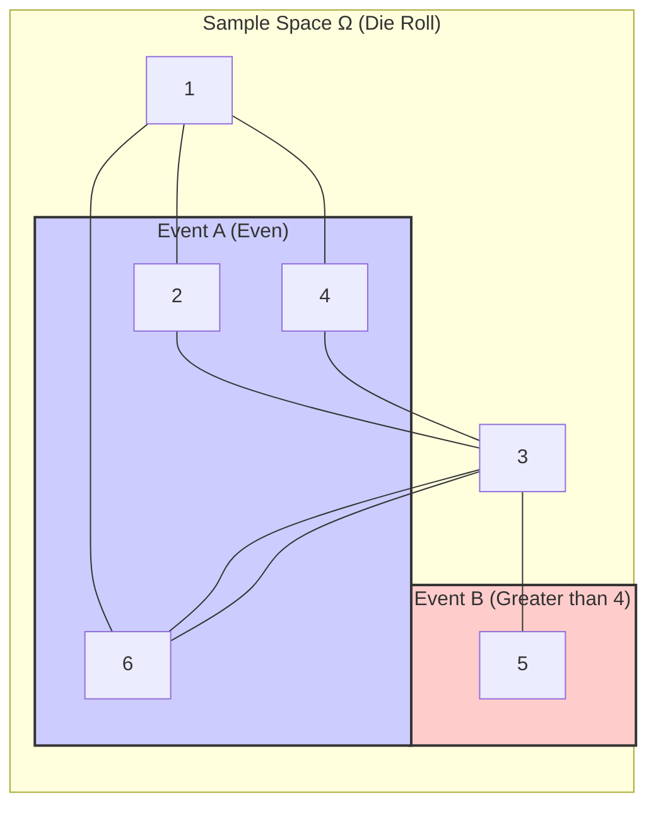
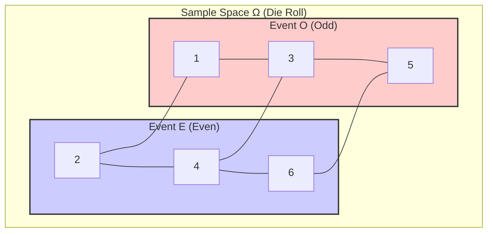

# Axioms of Probability
Imagine you want to build a sturdy, reliable skyscraper. You need incredibly strong foundations and fundamental principles that everything else rests upon. The Axioms of Probability, formulated by the great Russian mathematician Andrey Kolmogorov in the 1930s, are exactly that foundation for quantifying uncertainty.

Before we get to the axioms themselves, we need to agree on some basic vocabulary and concepts.

**Prerequisites: Setting the Stage**

1.  **Random Experiment:** This is any process or action whose outcome cannot be predicted with absolute certainty before it happens.
    *   *Examples:* Flipping a coin, rolling a standard six-sided die, measuring the temperature tomorrow at noon, picking a card from a shuffled deck.

2.  **Sample Space (Ω):** This is the set of *all possible* distinct outcomes of a random experiment. We usually denote it with the Greek letter Omega (Ω). It must be exhaustive (includes everything that could happen) and the outcomes within it must be mutually exclusive (only one outcome can occur per trial).
    *   *Example 1 (Coin Flip):* Ω = {Heads, Tails} or simply {H, T}.
    *   *Example 2 (Die Roll):* Ω = {1, 2, 3, 4, 5, 6}.
    *   *Example 3 (Measuring Temperature):* This is trickier. Theoretically, the temperature could be any real number within a certain range, say [-50°C, +60°C]. This sample space is *infinite* and *continuous*. Ω = [-50, 60].
    *   *Visual:* Think of the Sample Space Ω as a big box containing every single possible result of your experiment.

    ```mermaid
graph LR
    subgraph "Sample Space Ω (Die Roll)"
        1 --- 2 --- 3 --- 4 --- 5 --- 6
    end
```

3.  **Event (A, B, C, ...):** An event is a specific outcome or a collection of outcomes that we might be interested in. Mathematically, an event is a *subset* of the sample space Ω. We usually denote events with capital letters like A, B, C.
    *   *Example 1 (Die Roll, Ω = {1, 2, 3, 4, 5, 6}):*
        *   Event A: Rolling an even number. A = {2, 4, 6}.
        *   Event B: Rolling a number greater than 4. B = {5, 6}.
        *   Event C: Rolling a 3. C = {3}.
        *   The entire sample space Ω is itself an event (the "certain event" - something from Ω *must* happen).
        *   The empty set ∅ (or {}) is also an event (the "impossible event" - like rolling a 7 on a standard die).
    *   *Visual:* An event is like drawing a circle or a shape *inside* the box Ω, enclosing the specific outcomes that define the event.


    *Note: Outcome '6' is in both A and B.*

4.  **Set Operations on Events:** Since events are sets, we can use set operations:
    *   **Union (A ∪ B):** "A *or* B" occurs. This event includes all outcomes that are in A, or in B, or in both.
        *   *Example (Die Roll):* A = {2, 4, 6}, B = {5, 6}. A ∪ B = {2, 4, 5, 6}. (Rolling an even number or a number greater than 4).
        *   *Visual:* The total area covered by both circles A and B.
    *   **Intersection (A ∩ B):** "A *and* B" occur. This event includes all outcomes that are common to both A and B.
        *   *Example (Die Roll):* A = {2, 4, 6}, B = {5, 6}. A ∩ B = {6}. (Rolling an even number *and* a number greater than 4).
        *   *Visual:* The overlapping area between circles A and B.
    *   **Complement (A<sup>c</sup> or A'):** "Not A" occurs. This event includes all outcomes in the sample space Ω that are *not* in A.
        *   *Example (Die Roll):* A = {2, 4, 6}. A<sup>c</sup> = {1, 3, 5}. (Rolling an odd number).
        *   *Visual:* Everything inside the Ω box but *outside* the circle A.
    *   **Disjoint (or Mutually Exclusive) Events:** Two events A and B are disjoint if they cannot happen at the same time. This means they have no outcomes in common. Mathematically, their intersection is the empty set: A ∩ B = ∅.
        *   *Example (Die Roll):* Event E = "Rolling an even number" ({2, 4, 6}) and Event O = "Rolling an odd number" ({1, 3, 5}). E and O are disjoint. E ∩ O = ∅.
        *   *Visual:* Two separate circles inside the Ω box that do not touch or overlap.


**The Goal: Assigning Probabilities**

Now, we want to assign a number, called **probability**, to each event A. This number, denoted P(A), represents how likely that event is to occur. We intuitively feel that probabilities should be between 0 (impossible) and 1 (certain), and that bigger numbers mean higher likelihood.

The axioms are the fundamental rules that any such assignment function `P` *must* satisfy to be mathematically consistent and useful. Think of them as the constitution for probability.

**The Axioms of Probability (Kolmogorov Axioms)**

Let Ω be a sample space, and let P be a function that assigns a real number P(A) to every event A ⊆ Ω. Then P is a valid probability measure if and only if it satisfies the following three axioms:

**Axiom 1: Non-negativity**

*   **Statement:** The probability of any event must be greater than or equal to zero.
*   **Mathematical Form:** For any event A,
    $P(A) \ge 0$
*   **Intuition:** It makes no sense to talk about a negative chance of something happening. The lowest possible chance is zero, meaning it's impossible. You can't have less than impossible.
*   **Visual:** If you think of probability as a measure of "area" or "weight" associated with an event within the sample space, you cannot have negative area or negative weight.
*   **Example (Die Roll):** Let A = {2, 4, 6} (rolling an even number). Intuitively, for a fair die, P(A) = 3/6 = 1/2. This is ≥ 0. Let B = {7} (rolling a 7). P(B) = 0. This is also ≥ 0. The axiom simply states this must hold for *any* event you can define.

**Axiom 2: Normalization**

*   **Statement:** The probability of the entire sample space (the certain event) must be equal to one.
*   **Mathematical Form:**
    $P(\Omega) = 1$
*   **Intuition:** It is absolutely certain (100% probability) that *some* outcome from the set of all possible outcomes will occur when you perform the experiment.
*   **Visual:** If the entire sample space Ω is represented by a box, and probability is the "area" assigned to events, then the total area of the box *must* be 1. All probabilities are fractions or proportions of this total area.
*   **Example (Die Roll):** Ω = {1, 2, 3, 4, 5, 6}. The event that you roll a 1, or a 2, or a 3, or a 4, or a 5, or a 6 covers all possibilities. P(Ω) = 6/6 = 1.
*   **Example (Coin Flip):** Ω = {H, T}. The event that you get Heads or Tails is certain. P(Ω) = P({H, T}) = 1.

**Axiom 3: Additivity**

This is the most intricate axiom and comes in two parts: one for a finite number of events, and a crucial extension for an infinite number.

*   **Part A: Finite Additivity**
    *   **Statement:** If you have two events, A and B, that are *disjoint* (mutually exclusive, meaning they cannot happen together, A ∩ B = ∅), then the probability that *either* A *or* B occurs is the sum of their individual probabilities.
    *   **Mathematical Form:** If A and B are events such that $A \cap B = \emptyset$, then
        $P(A \cup B) = P(A) + P(B)$
    *   **Extension:** This extends to any *finite* number of pairwise disjoint events. If $A_1, A_2, ..., A_n$ are events such that $A_i \cap A_j = \emptyset$ for all $i \neq j$, then:
        $P(A_1 \cup A_2 \cup ... \cup A_n) = P(A_1) + P(A_2) + ... + P(A_n)$
        Or using summation notation:
        $P\left(\bigcup_{i=1}^{n} A_i\right) = \sum_{i=1}^{n} P(A_i)$
    *   **Intuition:** If two outcomes (or sets of outcomes) cannot overlap, the chance of getting one *or* the other is simply the sum of their individual chances. There's no double-counting involved because they are exclusive.
    *   **Visual:** If A and B are two separate, non-overlapping regions within the Ω box, the total area covered by both A and B together is just the Area(A) + Area(B).

    ```mermaid
    graph LR
    subgraph omega["Sample Space Ω (Area = 1)"]
        subgraph A["Event A (P(A))"]
            a1(("1"))
            a2(("2"))
        end
        subgraph B["Event B (P(B))"]
            b1(("3"))
            b2(("4"))
        end
    end
    style omega fill:#f5f5f5,stroke:#333,stroke-width:2px
    style A fill:#ccf,stroke:#333,stroke-width:2px,rx:10
    style B fill:#fcc,stroke:#333,stroke-width:2px,rx:10
    style a1 fill:#fff,stroke:#333,stroke-width:2px
    style a2 fill:#fff,stroke:#333,stroke-width:2px
    style b1 fill:#fff,stroke:#333,stroke-width:2px
    style b2 fill:#fff,stroke:#333,stroke-width:2px
    style space fill:none,stroke:none
```
    *   **Example (Die Roll):** Let A = {1} (rolling a 1), P(A) = 1/6. Let B = {2} (rolling a 2), P(B) = 1/6. A and B are disjoint. The event "rolling a 1 or a 2" is A ∪ B = {1, 2}. According to Axiom 3, P(A ∪ B) = P(A) + P(B) = 1/6 + 1/6 = 2/6 = 1/3. This matches our intuition.
    *   **Example (Die Roll, finite list):** Let $A_1=\{1\}$, $A_2=\{3\}$, $A_3=\{5\}$. These are pairwise disjoint. P(Odd) = P($A_1 \cup A_2 \cup A_3$) = P($A_1$) + P($A_2$) + P($A_3$) = 1/6 + 1/6 + 1/6 = 3/6 = 1/2.

*   **Part B: Countable Additivity (σ-additivity)**
    *   **Why is this needed?** Finite additivity is not strong enough to handle many important situations, especially those involving infinite sample spaces (like the temperature example, or repeatedly flipping a coin forever) or continuous probability distributions. We need a way to handle the union of an infinite sequence of disjoint events.
    *   **Statement:** If you have a *countably infinite* sequence of events $A_1, A_2, A_3, ...$ that are *pairwise disjoint* (meaning $A_i \cap A_j = \emptyset$ for all $i \neq j$), then the probability of their union (the event that at least one of them occurs) is the sum of their individual probabilities.
    *   **Mathematical Form:** If $A_1, A_2, A_3, ...$ is a sequence of pairwise disjoint events, then
        $P(A_1 \cup A_2 \cup A_3 \cup ...) = P(A_1) + P(A_2) + P(A_3) + ...$
        Or using summation notation:
        $P\left(\bigcup_{i=1}^{\infty} A_i\right) = \sum_{i=1}^{\infty} P(A_i)$
    *   **Intuition:** This extends the additivity principle to infinite sums. It essentially says that if you break down an event into infinitely many smaller, non-overlapping pieces, the total probability (or "measure") of the event is the sum of the probabilities of all those pieces. This is crucial for calculus-like operations in probability.
    *   **Visual:** Imagine a line segment of length 1 (representing $P(\Omega)=1$). Now, imagine dividing this segment into an infinite number of tiny, distinct pieces $A_1, A_2, ...$. Countable additivity says that the total length of the segment (which is 1) must be equal to the sum of the lengths of all the infinite pieces. It connects the discrete idea of summing probabilities to the continuous idea of integration (which is essentially a sum over infinitely many infinitesimally small pieces).
    *   **Example (Geometric Probability Conceptual):** Imagine throwing a dart at a square target (Ω). Assume the dart always hits the target. P(Ω) = 1. Now, imagine the target is divided into a countably infinite number of disjoint regions $R_1, R_2, R_3, ...$ (e.g., imagine dividing it into infinitely many vertical strips, then dividing each strip...). Countable additivity demands that the probability of hitting *any* of these regions, $P(R_1 \cup R_2 \cup ...)$, must be the sum of the probabilities of hitting each individual region: $\sum_{i=1}^{\infty} P(R_i)$. Since the regions cover the whole target (let's assume they do), this sum must equal $P(\Omega) = 1$.
    *   **Example (Coin Tossing until Heads):** Consider the experiment: Flip a fair coin until the first Head appears.
        *   Ω = {H, TH, TTH, TTTH, ... , T<sup>k-1</sup>H, ...}. This is a countably infinite sample space.
        *   Let $A_k$ be the event that the first Head occurs on the $k$-th flip. $A_k = \{T^{k-1}H\}$.
        *   $A_1 = \{H\}$, $P(A_1) = 1/2$.
        *   $A_2 = \{TH\}$, $P(A_2) = (1/2)(1/2) = 1/4$.
        *   $A_3 = \{TTH\}$, $P(A_3) = (1/2)^3 = 1/8$.
        *   In general, $P(A_k) = (1/2)^k$.
        *   The events $A_1, A_2, A_3, ...$ are pairwise disjoint (you can't have the first Head occur on both the 2nd and 3rd flip simultaneously).
        *   The event "getting a Head eventually" is the union $A_1 \cup A_2 \cup A_3 \cup ... = \bigcup_{k=1}^{\infty} A_k$. Intuitively, this event should be certain (probability 1), assuming the coin is fair and you flip indefinitely if needed.
        *   Using countable additivity (Axiom 3b):
            $P\left(\bigcup_{k=1}^{\infty} A_k\right) = \sum_{k=1}^{\infty} P(A_k) = \sum_{k=1}^{\infty} \left(\frac{1}{2}\right)^k$
        *   This is an infinite geometric series with first term $a = 1/2$ and common ratio $r = 1/2$. The sum is $\frac{a}{1-r} = \frac{1/2}{1 - 1/2} = \frac{1/2}{1/2} = 1$.
        *   So, the axioms (specifically countable additivity) confirm our intuition that the probability of eventually getting a Head is 1. Finite additivity alone couldn't have proven this rigorously.

**Why are these Axioms so Important?**

1.  **Consistency:** They ensure that probabilities behave in a logical and consistent way, aligning with our intuitive understanding of chance.
2.  **Foundation:** They are the bedrock upon which the entire mathematical theory of probability is built. All other properties and theorems of probability (like $P(A^c) = 1 - P(A)$, or $P(A \cup B) = P(A) + P(B) - P(A \cap B)$) can be logically *derived* from these three axioms.
3.  **Generality:** They work for simple cases (like coins and dice) and extremely complex ones involving infinite possibilities and continuous measurements. Countable additivity, in particular, bridges the gap between discrete and continuous probability.
4.  **Universality:** They provide a common language and framework for discussing uncertainty across all fields of science, engineering, economics, and more.

**Summary Table**

| Axiom Name            | Statement                                                                 | Mathematical Form                                                                                              | Intuition                                                                 | Visual Metaphor      |
| :-------------------- | :------------------------------------------------------------------------ | :------------------------------------------------------------------------------------------------------------- | :------------------------------------------------------------------------ | :------------------- |
| 1. Non-negativity     | Probability cannot be negative.                                           | $P(A) \ge 0$ for any event $A$                                                                                 | Chance can't be less than impossible.                                     | Area/Weight >= 0     |
| 2. Normalization      | The probability of the certain event (the whole sample space) is 1.       | $P(\Omega) = 1$                                                                                                | Something possible *must* happen (100% chance).                         | Total Area/Weight = 1 |
| 3. Additivity         | Probability of the union of disjoint events is the sum of their probabilities. |                                                                                                                | If events can't overlap, their chances add up simply.                     | Combined Area/Weight |
|   - Finite Additivity | For a finite set of pairwise disjoint events $A_1, ..., A_n$.               | $P\left(\bigcup_{i=1}^{n} A_i\right) = \sum_{i=1}^{n} P(A_i)$ if $A_i \cap A_j = \emptyset$ for $i \neq j$ | Summing chances for a few exclusive options.                              | Sum of separate areas |
|   - Countable Additivity| For a countably infinite sequence of pairwise disjoint events $A_1, A_2, ...$ | $P\left(\bigcup_{i=1}^{\infty} A_i\right) = \sum_{i=1}^{\infty} P(A_i)$ if $A_i \cap A_j = \emptyset$ for $i \neq j$ | Extends summing to infinite exclusive options; crucial for limits & continuity. | Sum of infinite pieces |

These axioms seem simple, almost obvious, but their careful formulation allows us to build a powerful and rigorous mathematical structure for understanding and working with randomness, which is essential for navigating and explaining the complexities of the world. They provide the fundamental rules of the game for probability.